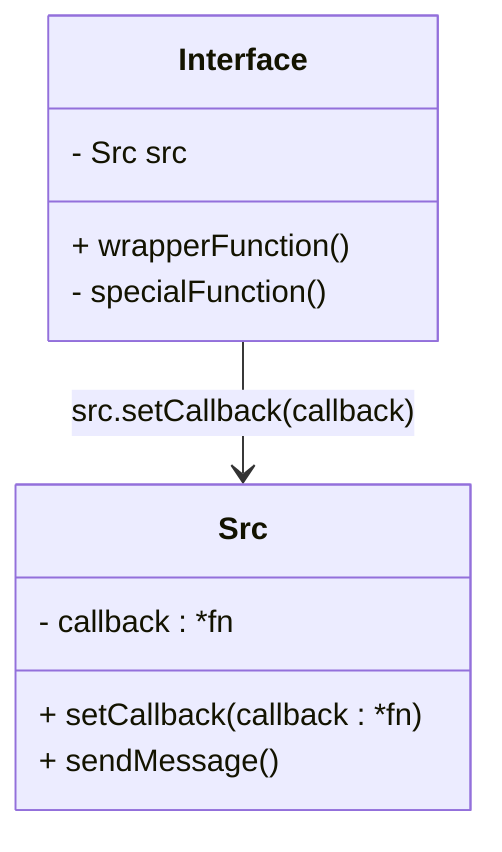
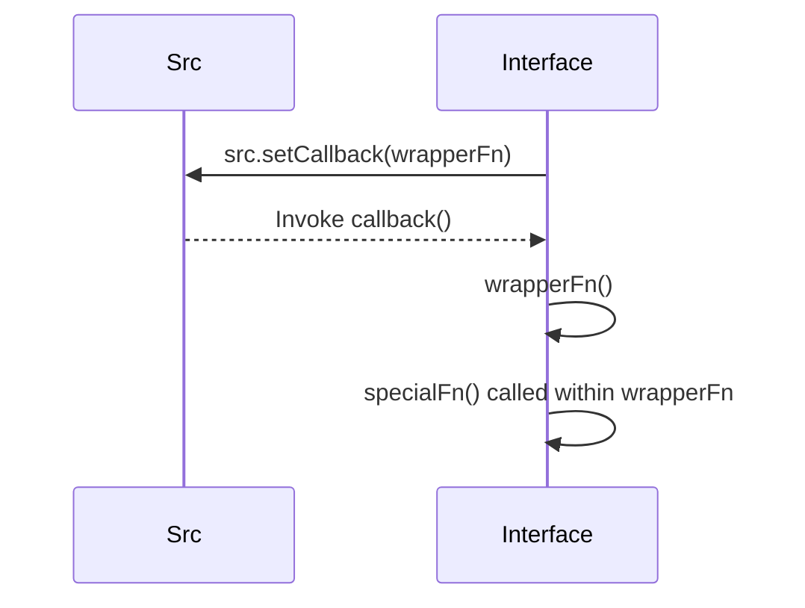

A *Callback* is a [[Computer Science/Function|Function]] represented by its [[Function Pointer]] whose invocation is deferred to its [[Caller]], which treats it as a black box.
* The callback is often passed to a function at runtime
* All [[Higher-Order Function]]s utilize callbacks
* Facilitates modularity and decoupling

